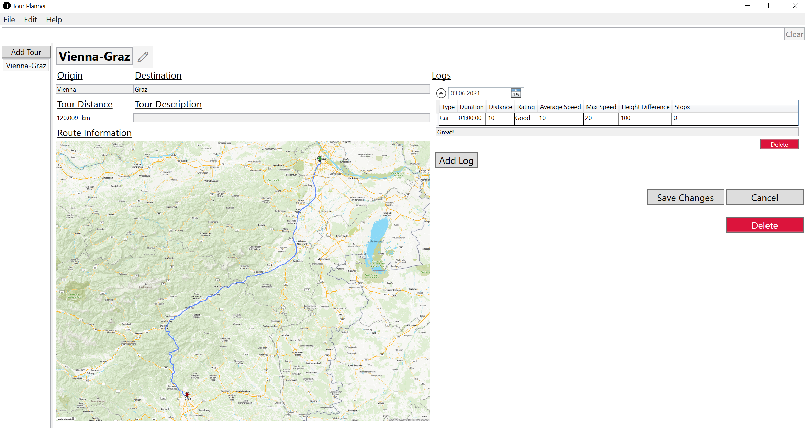

# SWE2-Tour-Planner

## :package: Requirements

* PostgreSQL Database     
  Tested with `Postgres 12` under `WSL2`.     

* Filled out configuration     
  The file `config.template.json` is a template file for the configuration. In order to take effect rename the file to `config.json`.         
  Following parameters can be tweaked:

  | Name                      | Function                                                     |
  | ------------------------- | ------------------------------------------------------------ |
  | `client:base-url`         | URL of the server which the client communicates to           |
  | `client:logger-config`    | Filename of the client logging configuration, leave untouched if not sure |
  | `server:port`             | Port on which the server listens to clients                  |
  | `server:db`               | Postgres database config consisting of the fields `user`, `password`, `ip` and `port` |
  | `server:logger-config`    | Filename of the server logging configuration, leave untouched if not sure |
  | `server:mapquest-api-key` | Your private key to the MapQuest API, find more about [here](https://developer.mapquest.com/plan_purchase/steps/business_edition/business_edition_free/register) |
  | `server:routes-path`      | Path in which the route information images are stored        |
  | `server:exports-path`     | Path in which the tour export pdfs are stored                |

## 🛠 Build 

```
dotnet build --configuration Release
```

Pre-build artefacts can be found [here](https://github.com/kurbaniec/SWE2-Tour-Planner/releases)

## 🚀 Run

Run Tour-Planner server

```
dotnet run --project .\Server\Server\Server.csproj
```

Run Tour-Planner server

```
dotnet run --project .\Client\Client\Client.csproj
```

## 🧪 Test

Run unit tests

```
dotnet test
```

---

## 🧾 Protocol 

### App Architecture

Tour-Planner is based on a Client-Server architecture where the server does all the heavy lifting like data management and persistence and the client is a simple thin-client that communicates with the server through REST-calls. This makes it possible to add or swap out client applications without touching the core business rules in the server.

Both server and client feature internally a layered architecture:

#### Server

* Services Layer     
  The server does not have a view or anything similar. Its utmost functionality is to provide access to the offered tour-planner services. This is done through REST-endpoints which are defined internally in the `Controllers` package in the `TourController` class. Each valid request is passed to the Business Layer and returned via a corresponding HTTP-Response. 
* Business Layer       
  The Business Layer implements the core functionality and encapsulates all relevant logic.  It is defined in the `BL` package and consists of the `TourPlannerServer` class which performs the functionality through mostly internal calls to the Data Access Layer.
* Data Access Layer      
  The server has three interfaces in the `DAL` package for different data access methods:
  * `IDataManagement`    
    Interface used for CRUD operations for the Tour models. Concrete implementation is the `PostgresDb` class.
  * `IMapApi`     
    Interface used to interact with a Map API. Concrete implementation is the `MapQuestApi` class.
  * `IExportHanlder`    
    Interface that describes a way to create a printable document. Concrete implementation is the `PdfExportHandler` class.

#### Client

* Presentation Layer    
  In comparison to the server the client has a typical GUI which the user can interact with. The Views are  defined in the `Views` package, corresponding ViewModels are found in the `ViewModels` package. Events from the Views typically trigger a Command in the ViewModels which calls the Business Layer when core functionality is affected.

* Business Layer    
  The Business Layer gives clients access to core functionality which in the current implementation means that the client asks the server to perform it and return the response back to the client. It is defined in the `Logic.BL` package in the `TourPlannerClient` class.

* Data Access Layer       
  The client has three interfaces in the `Logic.DAL` package for different data access methods:

  * `ITourApi`    
    Interface that describes methods to interact with the server. Concrete implementation is the `TourApi` class.
  * `IImportExportHandler`     
    Interfaces that defines serialization & deserialization of Tours with files. Concrete implementation is the `DataHandler` class.
  * `IFilter`   
    Interfaces that defines a way to filter objects. Concrete implementation is the `GeneralFilter` class.

  

Each project uses the same definition for the `Tour` data model which is found in its own Solution called `Model`.  

### UX Design

The client application uses WPF for visual representation. It is very basic and styling is minimal, nonetheless it features more modern features like a responsive design.

Tour addition is simple, the UI shows which fields are necessary or not and allows only further processing if all fields are filled.


The tour info page is the most sophisticated part of the UI. It features a responsive design which adapts to the width of the application window as seen in the next two images.


The info page is also used to update existing tours or adding new tour logs. To do so one must press the pencil ✏️ button next to the tour title to enter edit mode. When updating the origin and/or the destination of the tour the distance and route information image will be updated accordingly. One can add as many tour logs as one wants and also update and delete them in edit mode. 

After editing, changes can be saved or discarded. One can also delete the whole tour and all corresponding tour logs.



When a route information image cannot be loaded (poor network conditions or the server lost the corresponding image) the client will display an internally generated Bitmap image.


At the top one can find a search bar that searches the given keyword in all fields of tours and tour logs.


Here for example the search filter finds an corresponding match in the title of one tour.


### Used Libraries

List of some import libraries used throughout the project:

* `Webservice_Lib`    
  REST-server & Dependency Injection used in the server, based on last semesters Webservice project which can be used now as a [library](https://github.com/kurbaniec/WebServiceLib)
* `System.Windows` with `PresentationFramework`    
  WPF Framework for UI of the client
* `Npgsql`     
  Postgres Database Access in the server
* `Microsoft.Extensions.Logging` with `Log4Net `     
  Used for Logging in the server & client
* `Microsoft.Extensions.DependencyInjection `    
  Dependency Injection used in the client

### Implemented Design Patterns

* MVVM        
  Event driven programming of user interfaces which are separated in `View`, `ViewModel` and `Model` components.
  
* Mediator Pattern        
  Communication between objects through a mediator. The objects do not communicate together directly but instead rely on the mediator.  Used for communication between `ViewModel`s. 

### Unit Test Design

Unit tests are written with the help of the `Nunit` Framework and are separated in client tests and server tests.

#### Server

* `TourPlannerServerTest`      
  Tests the Business Layer of the server, especially validation rules (`Tour` from field cannot be empty and so on). Uses predefined classes that are used as substitutes instead of the concrete `DAL` classes.
* `PdfExportHandlerTest`    
  Checks if pdf export is working correctly (creating files for valid `Tour`s). This seems rather unnecessary but it provided very useful because the used pdf generation library  `QuestPDF` relied on another dependency which was not designed for Linux. Adding a reference to the valid Linux dependency when building the server on Linux fixed the problem.

#### Client

* `TourWrapperTest`   
  Tests the ViewModel which wraps the tour model and is used for binding. This is important because the Wrapper can save but also discard changes on the model. Only the underlying model is send to the server for CRUD operations so it needs to be guaranteed that it is always in a valid state.
* `TourLogWrapperTest`     
  Same as `TourWrapperTest` but for tour log models and not tours.
* `DataHandlerTest`     
  Tests the Import/Export of tours through the Business Layer and asserts that data is correctly serialized/deserialized.  
* `GeneralFilterTest`     
  Tests the Filter of tours (used in the View for the `ObservableCollection`) and checks if search keywords are found in tour or tour log properties.

### Unique Feature

The project uses Github Actions for testing & building of artefacts. If one pushes to the `main` or `development` branch the pipeline is triggered and executed.

On the [releases](https://github.com/kurbaniec/SWE2-Tour-Planner/releases) page one can find the latest builds. There one can find always two releases, the latest stable or latest development builds.


### Bonus Feature

The project implements an optional bonus feature: a REST-server that is responsible for data management and persistence.

### Time Tracking

Estimated time spent: ~ 65 - 75 h

### Link to git

https://github.com/kurbaniec/SWE2-Tour-Planner

### Encountered Problems

Most encountered problems were WPF-related. This was my first WPF project so I had to get used to the fundamentals of it and how layout/styling is achieved.

Some examples:

* Responsive Design     
  Implemented with a `WrapPanel` and two `Grid`s inside it. The width of the `Grid`s is capped through a custom `WidthConverter` class which reads the screen size and window size of the application and translates it accordingly.
* Scrolling      
  The logs in the tour info page are realized with a `ListView` which has an internal `ScrollViewer` by default. But it can be removed so the `ScrollViewer` of the page can work correctly.
* `DataGrid` with one item     
  Each log in the tour info page is represented through a `DataGrid` in an `Expander`. But `DataGrid`s typically do not support one single item. The solution is a custom `ItemSourceConverter` that takes an item and returns a plain List with only the item in it.

